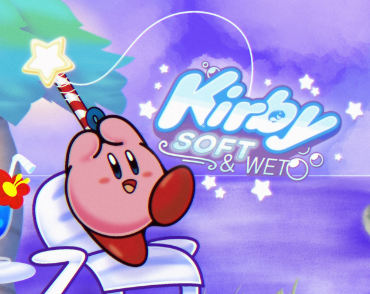

# 🎣 SillyTavern Kirby Fishing Side Game

Đắm chìm vào chuyến phiêu lưu câu cá thư giãn cùng Kirby ngay trong không gian trò chuyện của SillyTavern!



---

## 🌟 Giới thiệu về Kirby ~ Soft & Wet

**Kirby ~ Soft & Wet** là một tựa game fan-made đồ họa pixel retro tuyệt đẹp đưa chú bé hồng tròn ủm Kirby vào hành trình câu cá kỳ thú. Giờ đây, bạn có thể vừa nhập vai, trò chuyện cùng các nhân vật AI trong SillyTavern, vừa thảnh thơi buông cần câu cá cùng Kirby trong một cửa sổ nổi tiện lợi, mượt mà mà không cần chuyển đổi ứng dụng.

---

## 🐠 Những điều kỳ thú trong chuyến câu cá cùng Kirby

- 🎣 **Hơn 1,000 loài cá độc đáo:** Khám phá vô số vùng nước, từ hồ nước bình yên, đại dương sâu thẳm đến những vùng vịnh kỳ ảo để săn lùng và hoàn thành cuốn Bách khoa cá (**Fishbook**).
- 🎨 **Tùy biến phong cách:** Sắm sửa các bình xịt màu sắc (**Spray Paint**), đổi màu cho Kirby, trang bị nón mũ điệu đà, cùng hàng loạt loại mồi câu và phao nổi rực rỡ từ cửa hàng tạp hóa.
- 🤝 **Hội ngộ Dream Friends:** Đồng hành cùng những người bạn thân quen của xứ sở Dream Land như Gooey, Marx, Waddle Dee và nhiều nhân vật khác — mỗi người bạn đều mang đến sự cổ vũ ấm áp cho hành trình của bạn.
- 🏛️ **Xây dựng Thủy cung riêng (Aquarium):** Thu thập những loài cá quý hiếm nhất và thả chúng vào hồ thủy sinh lung linh của riêng bạn.

---

## 🎈 Tiện ích chơi game thông minh trong SillyTavern

- **Bóng nổi Kirby tròn trịa (FAB):** Biểu tượng Kirby tròn phát sáng luôn lơ lửng trên màn hình. Kéo thả tự do đến mọi vị trí thuận tiện nhất; click nhẹ để mở hoặc ẩn cửa sổ game tức thì.
- **Khóa tỷ lệ chuẩn 3:2 (GBA Native):** Cửa sổ nổi được tối ưu theo đúng tỷ lệ gốc của Game Boy Advance (`3:2`), **hoàn toàn không có viền đen thừa, không méo pixel và triệt tiêu 100% thanh cuộn**.
- **Chế độ bóng ma (Ghost Mode 👻):** Cửa sổ mờ dịu xuống (28% độ mờ) để bạn dễ dàng đọc trọn vẹn từng dòng tin nhắn của bot bên dưới; chỉ cần rê chuột vào là game sẽ sáng rõ trở lại để tương tác.
- **Nút âm thanh chuyên biệt (🔊 / 🔇):** Tắt/bật nhạc nền và hiệu ứng âm thanh nhanh chóng chỉ với 1 click, trạng thái âm thanh được ghi nhớ tự động.
- **Bảo vệ RAM & Chống mất save (Hold-to-Close 🛡️):**
  - Nút **Thu nhỏ (`➖`)**: Ẩn tạm thời, giữ nguyên tiến trình câu cá ngầm.
  - Nút **Đóng (`✕`)**: Yêu cầu **bấm giữ 1 giây** để tránh bấm nhầm. Khi tắt hẳn, game giải phóng 100% bộ nhớ RAM và WebAssembly, đưa mức chiếm dụng CPU về 0%.
- **Không cướp phím gõ chat:** Game được cách ly an toàn trong iframe, không bao giờ bắt trộm phím khi bạn đang gõ tin nhắn cho nhân vật trong SillyTavern.
- **Hiệu ứng AI Pulse:** Bóng nổi Kirby sẽ phát sáng nhấp nháy neon rực rỡ mỗi khi AI trong SillyTavern đang suy nghĩ và sinh phản hồi!

---

## 🎮 Hướng dẫn điều khiển

| Thao tác | Phím bấm |
| :--- | :--- |
| **Di chuyển / Điều hướng** | Phím mũi tên (Arrow Keys) hoặc `W` `A` `S` `D` |
| **Tương tác / Quăng cần / Chọn** | Phím `Z` hoặc `Space` |
| **Thoát / Hủy bỏ** | Phím `X` hoặc `Esc` |
| **Co giãn tự do (Freeform Resize)** | Giữ phím `Shift` khi kéo góc dưới bên phải cửa sổ |

---

## 📥 Hướng dẫn cài đặt

### Cách 1: Cài đặt trực tiếp qua giao diện SillyTavern (Khuyên dùng)
1. Mở SillyTavern ➔ Chọn biểu tượng **Extensions (Tiện ích mở rộng)** trên thanh công cụ.
2. Chọn mục **Install Extension** và dán đường dẫn:
   ```text
   https://github.com/Khanhhpk/sillytavern-kirby-fishing
   ```
3. Nhấn **Install** và làm mới trang web (**`Ctrl + F5`**).

### Cách 2: Cài đặt thủ công bằng Git
1. Mở terminal và chuyển đến thư mục extensions của SillyTavern:
   ```bash
   cd SillyTavern/public/scripts/extensions/third-party
   ```
2. Clone repository về:
   ```bash
   git clone https://github.com/Khanhhpk/sillytavern-kirby-fishing.git
   ```
3. Khởi động lại SillyTavern hoặc nhấn **`Ctrl + F5`** trên trình duyệt để bắt đầu trải nghiệm!

---

## 📜 Bản quyền & Ghi công

- **Nhân vật & Thương hiệu gốc:** Nhân vật Kirby, âm nhạc và bản quyền thuộc về **HAL Laboratory** & **Nintendo**.
- **Nguyên tác trò chơi:** Dự án game phi lợi nhuận **Kirby ~ Soft & Wet**.
- **Đóng gói SillyTavern Extension:** Thực hiện bởi **Khanhhpk** (kiến trúc giao diện lấy cảm hứng từ phong cách tiện ích *SillyTavern-KittyToy*).
